# Audit — Réponses

Ce document reprend la grille d'audit (`docs/nexus-audit.md`) question par question — la question exacte en anglais (citée telle quelle), puis la réponse en français avec preuve à l'appui. Le détail pas-à-pas (commandes, configs) est dans `docs/nexus-setup.md` — ce document-ci ne fait que répondre, pas ré-expliquer.

## Functional

### Setup Nexus Repository Manager

> **Has the Nexus Repository Manager been successfully installed and configured on a local or remote server?**

Oui. Nexus tourne en conteneur Docker (`sonatype/nexus3`), déclaré dans `docker-compose.yml` et lancé via `docker compose up -d nexus`. Voir `nexus-setup.md` étape 1.

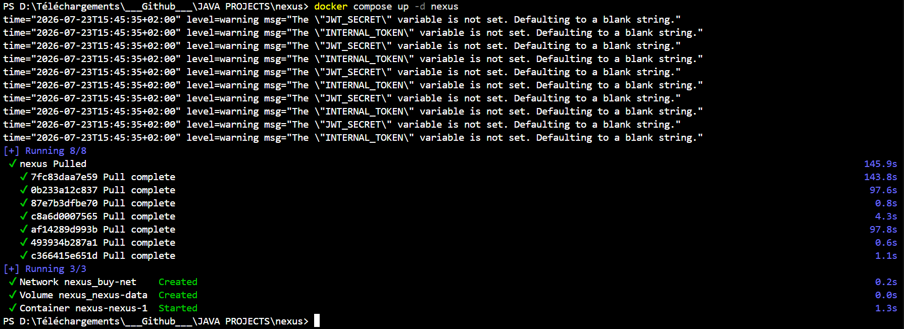

> **Is Nexus configured correctly to work under the specified user not 'root' user?**

Oui. L'image officielle fait tourner le process sous un utilisateur dédié non-root (`nexus`, uid 200) par défaut — vérifié directement :
```
docker exec -it nexus-nexus-1 id
→ uid=200(nexus) gid=200(nexus) groups=200(nexus)
```
Voir `nexus-setup.md` étape 2.

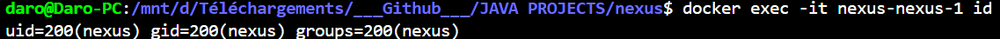

> **Are repositories set up for different artifact types such as JARs, WARs, and Docker images?**

Oui pour JAR et Docker (`maven-releases`, `maven-snapshots`, `maven-central`, `maven-public`, `docker`). WAR n'est pas applicable : le projet est en Spring Boot, qui ne produit que des `.jar` exécutables — choix délibéré, pas un oubli (voir note en fin de `nexus-setup.md`).

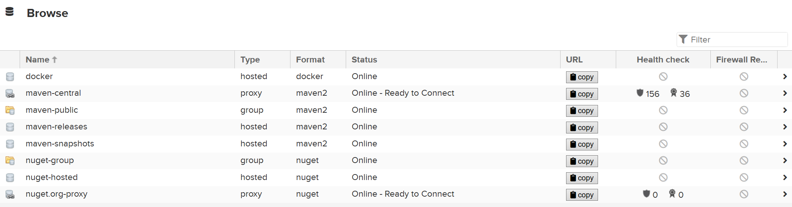

### Development and Structure

> **Is there a simple web application developed using the Spring Boot framework?**

Oui — buy-02, 5 microservices Spring Boot (`user-service`, `product-service`, `media-service`, `order-service`, `cart-service`).

> **Does the project utilize a proper Maven or Gradle project structure?**

Oui — chaque microservice est un projet Maven indépendant avec son propre `pom.xml`.

### Artifact Publishing

> **Is the build tool (Maven or Gradle) properly configured to publish built artifacts (JARs/WARs) to the relevant repositories in Nexus?**

Oui. `distributionManagement` ajouté dans chaque `pom.xml`, `mvn clean deploy` publie vers `maven-releases`/`maven-snapshots` selon la version. Voir `nexus-setup.md` étape 5.

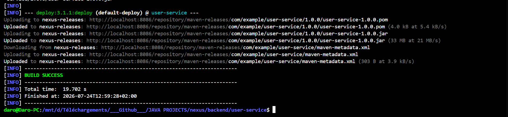

### Dependency Management

> **Is Nexus used as a proxy for fetching external dependencies required by the web application?**

Oui. Même en demandant explicitement une autre URL en ligne de commande, le mirror de `settings.xml` (`<mirrorOf>*</mirrorOf>`) redirige tout vers `maven-public`, y compris des dépendances tierces réelles (`commons-lang3`, `httpclient`...), jamais directement vers `repo.maven.apache.org`. Voir `nexus-setup.md` étape 5 point 3.

> **Is the project configured to resolve dependencies from Nexus repositories?**

Oui, via `~/.m2/settings.xml` (mirror `maven-public`). Voir `nexus-setup.md` étape 4.

### Versioning

> **Is versioning implemented for the web application and its artifacts using Nexus capabilities?**

Oui. `maven-releases` refuse par défaut tout redeploy sur une version déjà publiée (immutabilité), `maven-snapshots` reste librement redéployable pour le dev. Démonstration complète sur `user-service` : publication de `1.0.0`, tentative de redeploy refusée, publication de `1.1.0`. Voir `nexus-setup.md` étape 6.

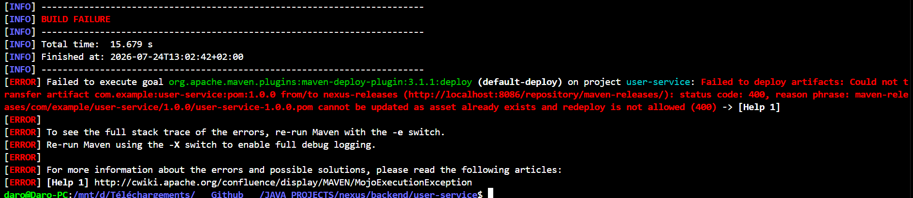

> **Are different versions of artifacts effectively retrieved and managed?**

Oui. `1.0.0` et `1.1.0` coexistent dans Nexus, et `1.0.0` a été explicitement récupérée après suppression du cache local (`mvn dependency:get`), prouvant que ce n'est pas juste la dernière version qui est accessible.

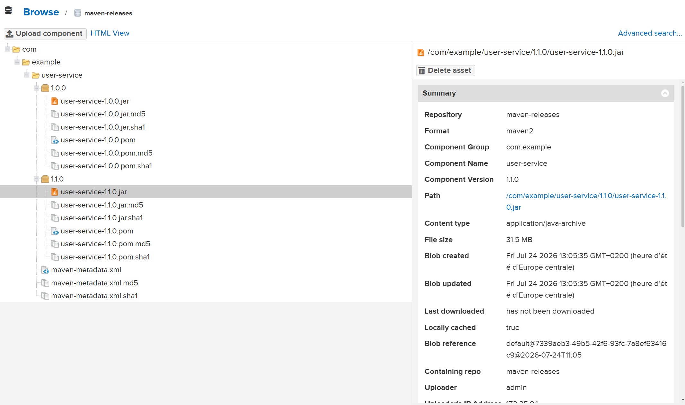
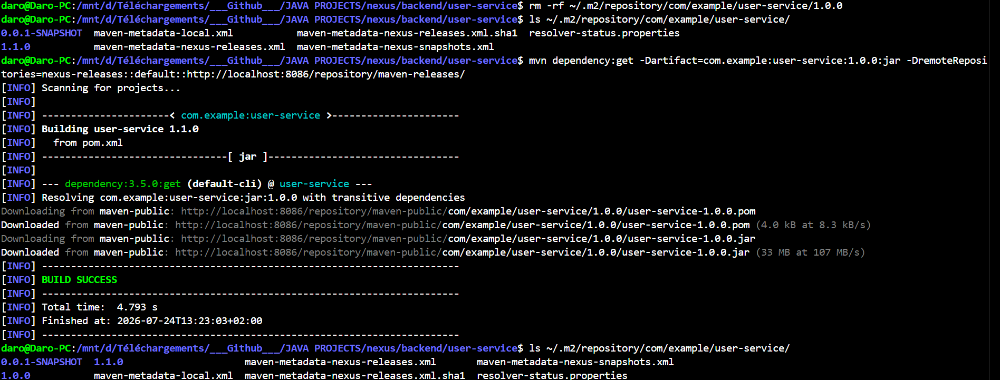

### Docker Integration

> **Is there a Docker repository set up in Nexus, and is the Docker image published to the repository?**

Oui. Repo hosted `docker` sur le connecteur `5001`, Docker Bearer Token Realm activé, image `cart-service:1.2.2` poussée et visible dans Nexus. Voir `nexus-setup.md` étape 7.

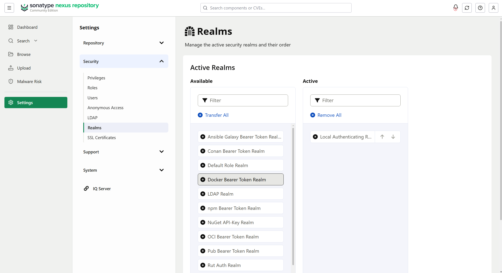
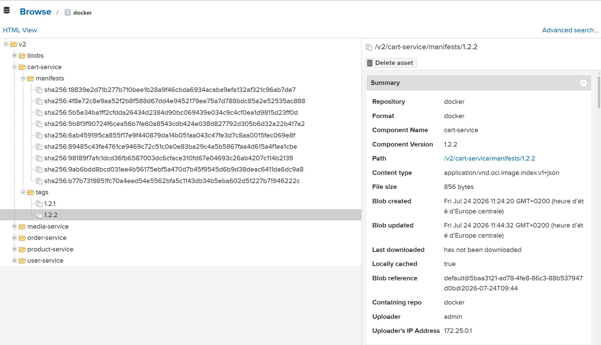

### Continuous Integration (CI)

> **Does the pipeline automatically trigger builds, tests, and artifact publishing upon repository changes?**

Oui. Le `Jenkinsfile` publie automatiquement (Maven `deploy` + `docker push`) à chaque push/PR, en plus des stages build/test existants, avec credentials centralisés (`nexus-creds`, jamais en clair). Voir `nexus-setup.md` étape 8.

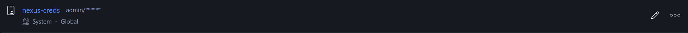
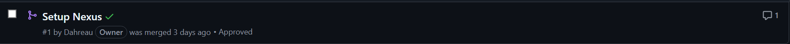

### Documentation

> **Is clear and detailed documentation provided for project setup, configuration, and usage?**

Oui — `docs/nexus-setup.md` (récit chronologique complet) + ce document de réponses.

> **Does the documentation include relevant screenshots and examples?**

Oui, voir les deux documents ci-dessus.

## Bonus: Nexus Security and Access Control

### Security Exploration

> **+Have Nexus security features like user authentication and role-based access control been explored?**

Non traité — section explicitement marquée bonus/optionnelle dans la grille d'audit, hors scope choisi pour ce projet.

> **+Are repository-level permissions effectively configured?**

Non traité — idem.

### Configuration

> **+Are security settings configured to restrict access to specific artifacts or repositories in Nexus?**

Non traité — idem.
