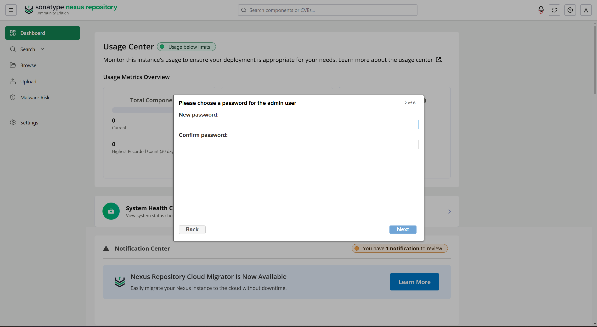
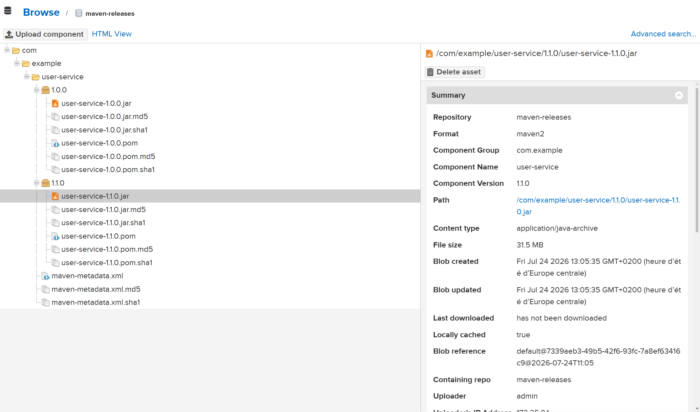

# Nexus — buy-02

## Prérequis

WSL Ubuntu avec :

- Docker
- Maven (Java 17, aligné avec le projet — pas besoin de bascule Java 11/17 puisque Nexus tourne en conteneur, pas en process natif)

Jenkins avec Docker Pipeline (déjà en place, voir `Jenkinsfile`).

## Étape 1 installation

1- Contrairement à une install native (télécharger le `.tar.gz`, créer un utilisateur système `nexus` à la main), on fait tourner Nexus en conteneur Docker. Déclaré dans `docker-compose.yml` :

```yaml
nexus:
  image: sonatype/nexus3:latest
  restart: unless-stopped
  ports:
    - "8086:8081" # UI/API Nexus
    - "5001:5001" # registre Docker hosted
  volumes:
    - nexus-data:/nexus-data
  networks:
    - buy-net
```

2- Démarrage :

```bash
docker compose up -d nexus
```


3- Schéma de ports

| Service               | Port | Description                                                                     |
| --------------------- | ---- | ------------------------------------------------------------------------------- |
| Jenkins               | 8080 | Pipeline CI/CD                                                                  |
| Nexus Web UI          | 8086 | Interface web d'administration (mappé depuis le port interne 8081 du conteneur) |
| Nexus Docker registry | 5001 | Dépôt Docker privé                                                              |
| User Service          | 8081 | Microservice utilisateurs                                                       |
| Product Service       | 8082 | Microservice produits                                                           |
| Media Service         | 8083 | Microservice médias                                                             |
| Order Service         | 8084 | Microservice commandes                                                          |
| Cart Service          | 8085 | Microservice panier                                                             |

## Étape 2 vérification de l'utilisateur non-root

1- Pas de manip manuelle nécessaire ici : l'image officielle `sonatype/nexus3` fait déjà tourner le process sous un utilisateur système dédié à l'intérieur du conteneur.

2- Vérification :

```bash
docker exec -it nexus-nexus-1 id
```

3- résultat attendu :

```
uid=200(nexus) gid=200(nexus) groups=200(nexus)
```


## Étape 3 configuration côté Nexus

1- Ouvrir le navigateur, aller à l'adresse :

```
http://localhost:8086
```

2- Création du premier utilisateur admin



3- Création des repos (Server administration and configuration → Repository → Create repository) :

| Nom               | Type   | Rôle                                                     |
| ----------------- | ------ | -------------------------------------------------------- |
| `maven-releases`  | hosted | versions stables, figées                                 |
| `maven-snapshots` | hosted | versions en développement                                |
| `maven-central`   | proxy  | cache du dépôt Maven Central                             |
| `maven-public`    | group  | point d'entrée unique agrégeant tous les repos ci-dessus |
| `docker`          | hosted | images Docker du projet, connecteur HTTP port 5001       |


## Étape 4 configuration de Maven (client-side)

1- Aller dans le fichier :

```bash
nano ~/.m2/settings.xml
```

2- Écrire dedans :

```xml
<settings>
  <servers>
    <server>
      <id>nexus-releases</id>
      <username>admin</username>
      <password>mot-de-passe</password>
    </server>
    <server>
      <id>nexus-snapshots</id>
      <username>admin</username>
      <password>mot-de-passe</password>
    </server>
  </servers>
  <mirrors>
    <mirror>
      <id>maven-public</id>
      <mirrorOf>*</mirrorOf>
      <url>http://localhost:8086/repository/maven-public/</url>
    </mirror>
  </mirrors>
</settings>
```

Le mirror `<mirrorOf>*</mirrorOf>` force Maven à solliciter Nexus pour toutes les dépendances, garantissant le rôle de proxy — y compris quand une autre URL est explicitement demandée en ligne de commande (voir étape 6).

## Étape 5 intégration du projet (artifact deployment)

1- Configuration des `pom.xml` : dans chacun des 5 microservices (`user-service`, `product-service`, `media-service`, `order-service`, `cart-service`) ajouter :

```xml
<distributionManagement>
    <repository>
        <id>nexus-releases</id>
        <url>http://localhost:8086/repository/maven-releases/</url>
    </repository>
    <snapshotRepository>
        <id>nexus-snapshots</id>
        <url>http://localhost:8086/repository/maven-snapshots/</url>
    </snapshotRepository>
</distributionManagement>
```

Maven choisit tout seul le repo de destination selon le numéro de version : suffixe `-SNAPSHOT` → `nexus-snapshots`, sinon → `nexus-releases`.

2- Déploiement du projet :

```bash
mvn clean deploy -DskipTests
```

L'artefact `.jar` est visible dans le dépôt `maven-snapshots` de l'interface Nexus.



3- Preuve que Nexus proxy bien les dépendances externes (pas que nos propres artefacts) : en demandant explicitement à Maven d'aller chercher un artefact directement sur Maven Central via `-DremoteRepositories=...`, le mirror (`<mirrorOf>*</mirrorOf>`) redirige quand même tout vers `maven-public` — y compris des dizaines de dépendances tierces réelles (`commons-lang3`, `httpclient`, `httpcore`, modules `doxia`...), jamais vers `repo.maven.apache.org` :

```bash
rm -rf ~/.m2/repository/org/apache/commons/commons-lang3/3.8.1
mvn dependency:get -Dartifact=org.apache.commons:commons-lang3:3.8.1:jar -DremoteRepositories=central::default::https://repo.maven.apache.org/maven2/
```

```
Downloading from maven-public: http://localhost:8086/repository/maven-public/org/apache/commons/commons-lang3/3.8.1/commons-lang3-3.8.1.jar
Downloaded from maven-public: .../commons-lang3-3.8.1.jar (502 kB at 290 kB/s)
Downloading from maven-public: http://localhost:8086/repository/maven-public/org/apache/httpcomponents/httpclient/4.5.13/httpclient-4.5.13.jar
Downloaded from maven-public: .../httpclient-4.5.13.jar (780 kB at 464 kB/s)
```

Le flag CLI demandait explicitement Maven Central — le log répond quand même `maven-public`, donc `localhost:8086`. C'est la preuve : impossible de contourner Nexus, même en essayant.

## Étape 6 gestion du versioning avec Nexus

Démonstration faite sur `user-service`.

-Immuabilité : le dépôt `maven-releases` refuse par défaut tout redeploy sur une version déjà publiée.
-Traçabilité : chaque version release reste consultable indéfiniment dans Nexus.

1- Publication d'une première release :

```bash
# pom.xml : <version>1.0.0</version>
mvn clean deploy -DskipTests
```

```
BUILD SUCCESS — Uploaded to nexus-releases: .../user-service-1.0.0.jar
```


2- Preuve d'immutabilité — retenter le même deploy, sans rien changer :

```bash
mvn clean deploy -DskipTests
```

```
BUILD FAILURE
[ERROR] ... status code: 400, reason phrase: maven-releases/.../user-service-1.0.0.pom
cannot be updated as asset already exists and redeploy is not allowed (400)
```


3- Publication d'une deuxième version :

```bash
# pom.xml : <version>1.1.0</version>
mvn clean deploy -DskipTests
```


4- Récupération explicite d'une version précise (pas juste la dernière) :

```bash
rm -rf ~/.m2/repository/com/example/user-service/1.0.0
mvn dependency:get -Dartifact=com.example:user-service:1.0.0:jar -DremoteRepositories=nexus-releases::default::http://localhost:8086/repository/maven-releases/
```

```
Downloading from maven-public: .../user-service-1.0.0.jar
Downloaded from maven-public: .../user-service-1.0.0.jar (33 MB at 107 MB/s)
BUILD SUCCESS
```


5- Retour en mode développement : une fois la démo terminée, `user-service` est repassé en `1.2.0-SNAPSHOT` pour ne pas bloquer les futurs déploiements automatiques de la CI (une release publiée refuse tout redeploy, y compris depuis Jenkins). Les versions `1.0.0` et `1.1.0` restent consultables indéfiniment dans `maven-releases`.

## Étape 7 gestion des artefacts Docker avec Nexus

1- Vérification du repo docker dans Nexus : http bien sur `5001`, URL sur `http://localhost:8086/repository/docker/`

2- Configuration du Docker Bearer Token Realm : Security → Realms → activer "Docker Bearer Token Realm"


3- Workflow de publication d'une image :

```bash
docker login localhost:5001
docker build -t cart-service:1.2.2 .
docker tag cart-service:1.2.2 localhost:5001/cart-service:1.2.2
docker push localhost:5001/cart-service:1.2.2
```


## Étape 8 intégration continue (Jenkins)

1- Le `Jenkinsfile` publie automatiquement à chaque push/PR, en plus des builds/tests existants :

- stage **"Publish Backend Artifacts to Nexus"** — `mvn deploy` en parallèle sur les 5 services
- stage **"Publish Docker Images to Nexus"** — build, tag (`1.2.${env.BUILD_NUMBER}`), push de chaque image

2- Gestion sécurisée des secrets : credential Jenkins dédié `nexus-creds`, injecté via `withCredentials(...)` en variables d'environnement temporaires (`NEXUS_USER`/`NEXUS_PASS`) — jamais en clair dans le repo, jamais dans les logs (masqué automatiquement par Jenkins).


## Note — WAR non applicable

Le projet buy-02 est en Spring Boot, qui embarque son propre serveur et ne produit que des `.jar` exécutables. WAR est un format pensé pour être déployé dans un serveur externe (Tomcat...), non pertinent pour ce type d'application — choix délibéré, pas un oubli.
